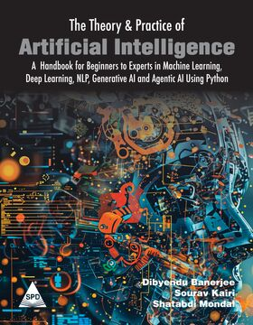

# 🧠 The Theory & Practice of Artificial Intelligence



## 📚 About the Book

**The Theory and Practice of Artificial Intelligence**  
*A Handbook for Beginners to Experts in Machine Learning, Deep Learning, NLP, Generative AI, and Agentic AI Using Python*

Authored by:  
**Dibyendu Banerjee**, **Sourav Kairi**, **Shatabdi Mondal**

This book provides a comprehensive and practical journey from the foundations of AI to advanced applications, using modern Python-based frameworks and tools. It is designed for learners at all levels — from curious beginners to experienced professionals aiming to expand their AI skillset.

---

## 💻 About This Repository

This repository contains all the **code snippets**, **notebooks**, and **project templates** referenced throughout the chapters of the book.

> 🧩 Whether you're following along with theory, implementing models, or experimenting with GenAI and Agentic AI tools — this is your hands-on companion.

---

## 🗂️ Repository Structure
📁 code/
│ ├── chapter1_intro_to_ai/
│ ├── chapter2_ml_basics/
│ ├── chapter3_deep_learning/
│ ├── chapter4_nlp/
│ ├── chapter5_generative_ai/
│ ├── chapter6_agentic_ai/
│ └── utils/
│
📘 README.md
📦 requirements.txt


---

## 🔧 Requirements

Make sure you have Python 3.8+ installed.  
To install the dependencies:


```bash
pip install -r requirements.txt

## 🚀 Quick Start
git clone https://github.com/yourusername/theory-practice-ai.git
cd theory-practice-ai
pip install -r requirements.txt

📜 License
This repository is for educational and reference purposes.
© 2025 Dibyendu Banerjee, Sourav Kairi, Shatabdi Mondal. All rights reserved.
